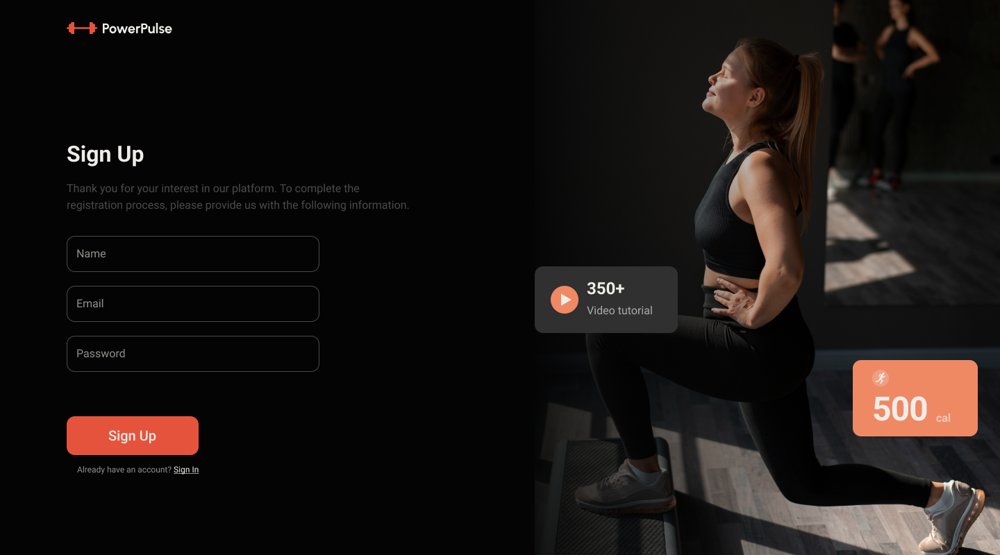
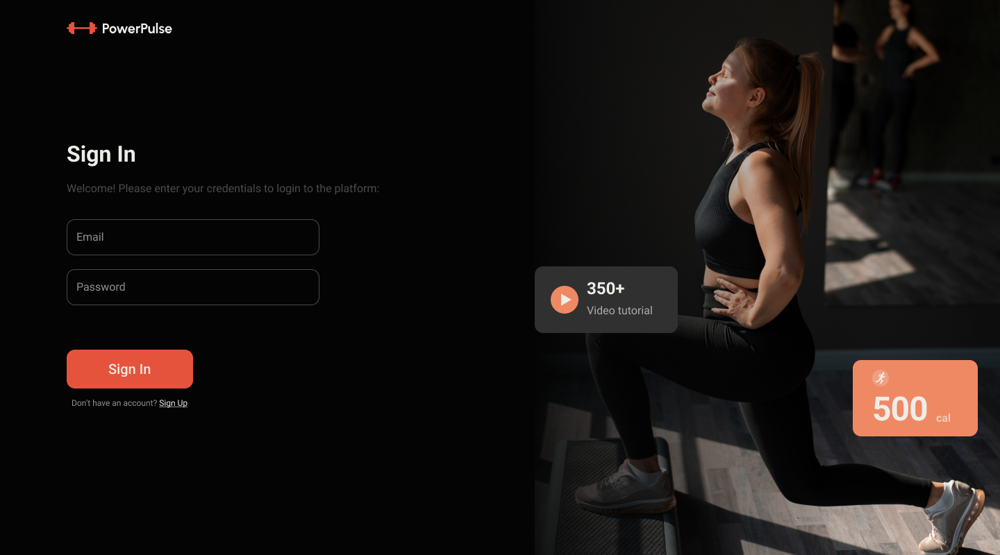

Hello, strangers!

Allow us to introduce you to Power Pulse: an innovative and beneficial app
designed to support your health and fitness journey. Power Pulse is more than
just an app: it's your personal assistant on the path to health and harmony.

🌟 Welcome (/welcome): On the first page, Power Pulse welcomes you. Here, you
can register a new account or log in to an existing one. Explore your current
statistics right from the first day!

📝 Sign Up (/signup): Register using your name, email, and a secure password.

🚀 Sign In (/signin): For those already with us, simply enter your email and
password.

💻/👤 Data Input / Profile (/profile): After successful registration, you will
find the data input page, where you need to fill in all necessary information
about yourself for your goals. On the profile page, you can view and update your
data going forward.

📖 Diary (/diary): Keep track of your nutrition and workouts on the diary page.
The information panel will help you understand your progress.

🍏 Products (/products): Choose products for your diary. Filters will help you
find the perfect choices for you.

💪 Exercises (/exercises): Explore the exercises section. Select exercises based
on categories and equipment.

# Development team :

- ANASTASIIA NIKITINA **Front end Team Lead & Scrum Master**,
- SERHII PEREVERTNIUK **Front End Developer**,
- KATERYNA KOKHAS **Front End Developer**,
- TETIANA MOSKALIUK **Front End Developer**,
- OLEKSII HOSTRYK **Front End Developer**,
- ROMAN PROTSENKO **Front End Developer**,

- ANTON TYSLENKO **Back end Team Lead**,
- OLEKSANDR SHEVCHENKO **Back end Developer**,
- EDUARD KURISH **Back end Developer**,
- HRYHORII KYRIIENKO **Back end Developer**.

# Technologies used:

Frontend:

- HTML/CSS,
- JS,
- React,
- Redux,
- Persist,
- Axios,
- Vite

Backend:

- Node.js,
- Mongo DB,
- Render.
